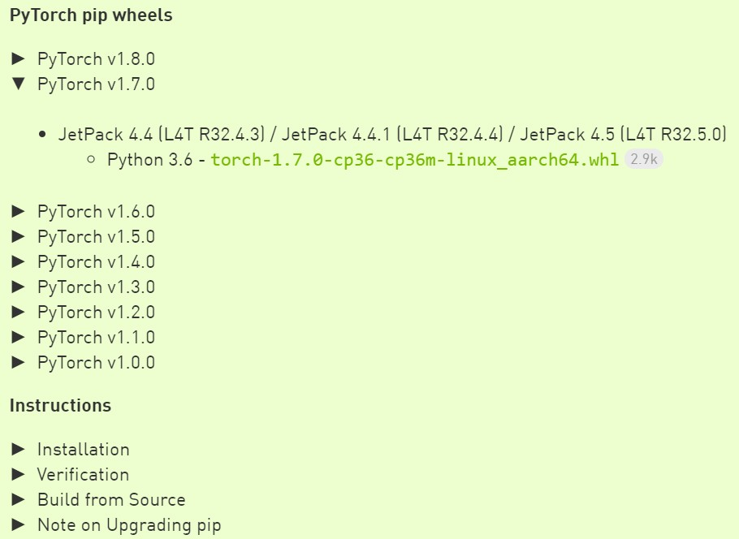

# Nviadia Jetson Nano Pytorch  environment

## nvcc

```bash
$ sudo gedit ~/.bashrc
```

- add at the end of  `~/.bashrc`

```bash
export CUDA_HOME=/usr/local/cuda-10.2
export LD_LIBRARY_PATH=/usr/local/cuda-10.2/lib64:$LD_LIBRARY_PATH
export PATH=/usr/local/cuda-10.2/bin:$PATH
```

```bash
$ source ~/.bashrc
```

- test

```bash
$ nvcc -V
nvcc: NVIDIA (R) Cuda compiler driver
Copyright (c) 2005-2019 NVIDIA Corporation
Built on Wed_Oct_23_21:14:42_PDT_2019
Cuda compilation tools, release 10.2, V10.2.89
```

## install pip3

```bash
$ sudo apt-get update -y
```

```bash
$ sudo apt-get install python3-pip -y
```

```bash
$ pip3 install -U pip
```

## install pytorch1.4 & torchvision

1. check jetpack version

   ```bash
   $ cat /etc/nv_tegra_release
   # R32 (release), REVISION: 4.4, GCID: 23942405, BOARD: t210ref, EABI: aarch64, DATE: Fri Oct 16 19:44:43 UTC 2020
   ```

   > REVISION: 4.4

2. download  `torch-1.7.0-cp36-cp36m-linux_aarch64.whl`  from [here](https://forums.developer.nvidia.com/t/pytorch-for-jetson-version-1-8-0-now-available/72048)

   

3. prepare to install pytorch

   ```bash
   $ sudo apt-get install python3-pip libopenblas-base libopenmpi-dev
   $ pip3 install Cython
   ```

4. install pytorch

   ```bash
   $ pip3 install torch-1.7.0-cp36-cp36m-linux_aarch64.whl
   ```

5. set OPENBLAS_CORETYPE

   ```bash
   sudo gedit ~/.bashrc
   ```

   - add this at the end of  `~/.bashrc`

   ```bash
   set OPENBLAS_CORETYPE=ARMV8
   ```

   ```bash
   $ source ~/.bashrc
   ```

6. test pytorch

   ```bash
   $ python3
   >>> import torch
   >>> torch.__version__
   '1.7.0'
   ```
   
7. install torchvision

   ```bash
   $ sudo apt-get install libjpeg-dev zlib1g-dev libpython3-dev libavcodec-dev libavformat-dev libswscale-dev
   $ git clone --branch v0.8.1 https://github.com/pytorch/vision torchvision   # see below for version of torchvision to download
   $ cd torchvision
   $ export BUILD_VERSION=0.8.1  # where 0.8.1 is the torchvision version  
   $ python3 setup.py install --user
   $ cd ../  # attempting to load torchvision from build dir will result in import error
   ```

8. test torchvision

   ```bash
   $ python3
   >>> import torchvision
>>> torchvision.__version__
   '0.8.1'
   ```
   

